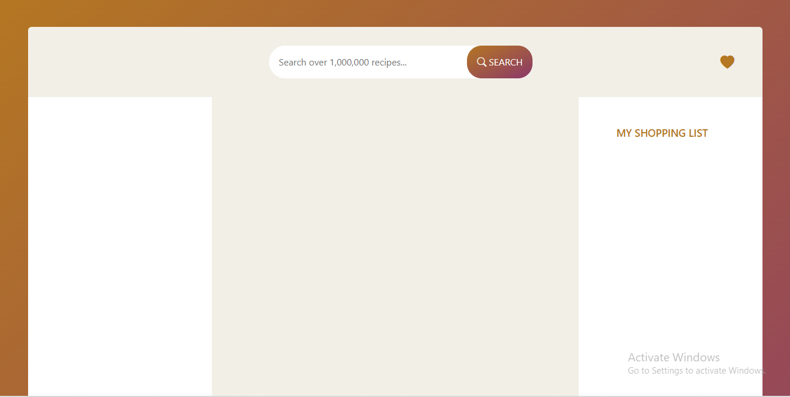
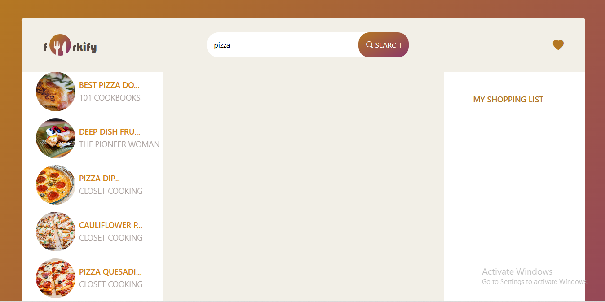
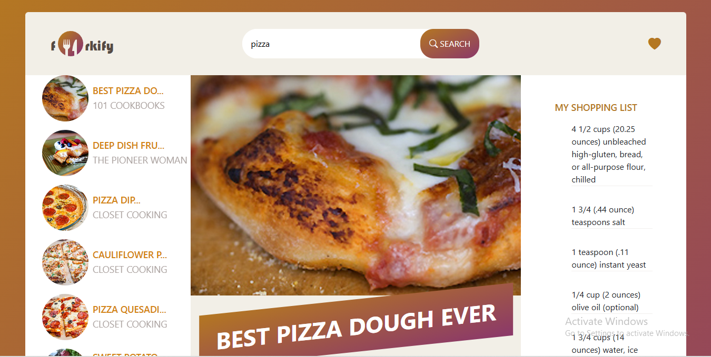

# My Forkify App using Angular
This app lets users search for over a million recipes, view detailed cooking instructions, and manage their favorite recipes in a shopping list-style interface.

## Features
```bash
Search recipes from a third-party API

View detailed recipe ingredients and instructions

Add ingredients to a shopping list

```
## Built With
```bash
Angular

TypeScript

Bootstrap

Css

Html

Forkify API
```

<p align="center">
  
  
  
</p>